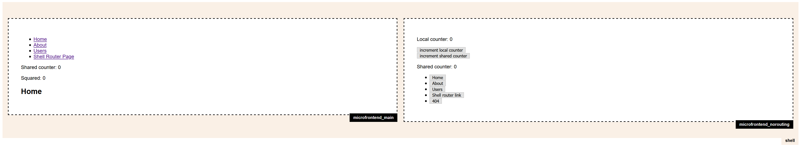

# micro_frontends



A microfrontend architecture written for training purposes. Based on the following projects:

- [h-include](https://github.com/gustafnk/h-include)
- [react](https://github.com/facebook/react)
- [react-dom](https://github.com/facebook/react/tree/master/packages/react-dom)
- [mobx](https://github.com/mobxjs/mobx)
- [wouter](https://github.com/molefrog/wouter)

## Install dependencies and Run

### Install dependencies

To install dependencies follow the following procedure:

```bash
#in the repo root folder
yarn install --dev
cd microfrontend_main && yarn install
cd microfrontend_norouting && yarn install
```

### Run for development

To serve the project at `http://localhost:4000` follow the following procedure:
```bash
yarn serve #in the repo root folder
```

### Run dockerized with NGNIX Server Side Includes
To serve the project at `http://localhost:5000` follow the following procedure:
```bash
#in the repo root folder
yarn build
yarn build_main
yarn build_norouting
docker-compose up --build
```
